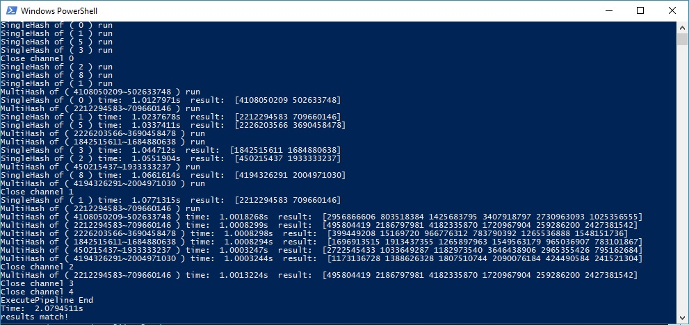

## Func Pipe
В функцию передаеться массив функций, которые выполняют работу и передают результат через канал в слудующию функцию. Каждая функция запускается в отдельной гоурутине и ждет пока закончится поток данных.  

``` go
freeFlowJobs := []job{
    job(func(in, out chan interface{}) {
        out <- uint32(1)
        out <- uint32(3)
        out <- uint32(4)
    }),
    job(func(in, out chan interface{}) {
        for val := range in {
            out <- val.(uint32) * 3
            time.Sleep(time.Millisecond * 100)
        }
    }),
    job(func(in, out chan interface{}) {
        for val := range in {
            fmt.Println("collected", val)
            atomic.AddUint32(&recieved, val.(uint32))
        }
    }),
}

ExecutePipeline(freeFlowJobs...)
```

В данном случае, передается массив чисел, для элементов которого высчитывается хеш сумма и сортируется результат.



