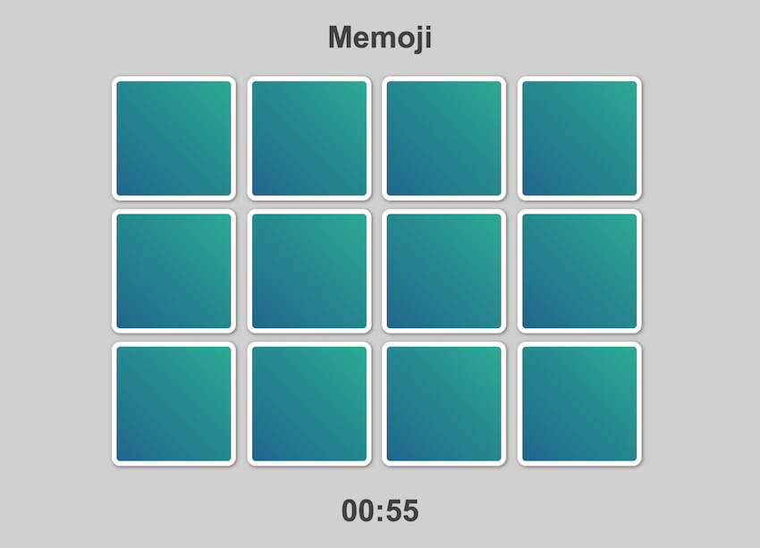
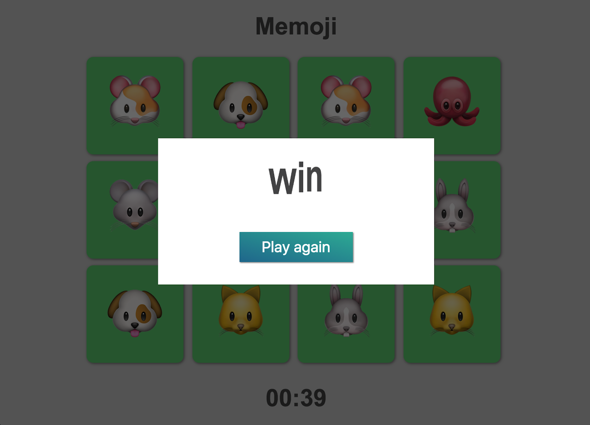
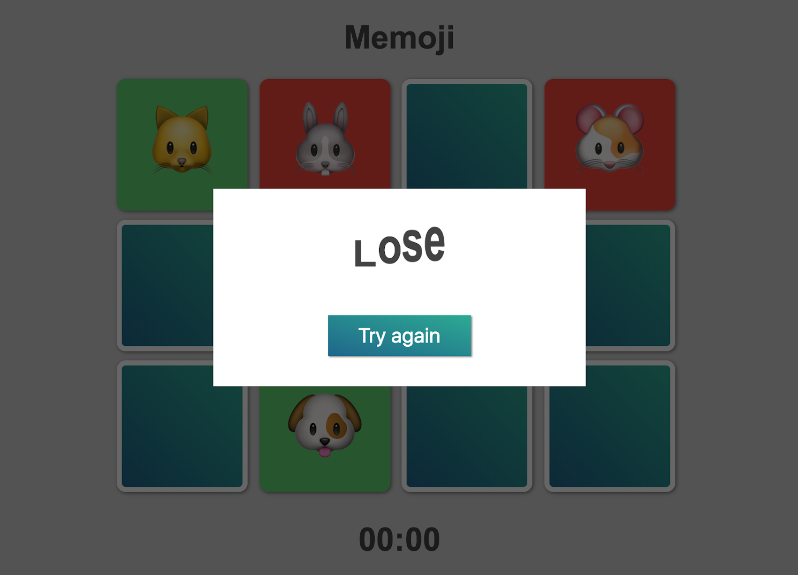

## HTML CSS JS
Есть колода карточек с парными изображениями. Колода раскладывается в случайном порядке рубашкой вверх. Игрок может открывать 2 карточки за один ход. Если при открытии карт образовалась «парочка», она остаётся открытой.

