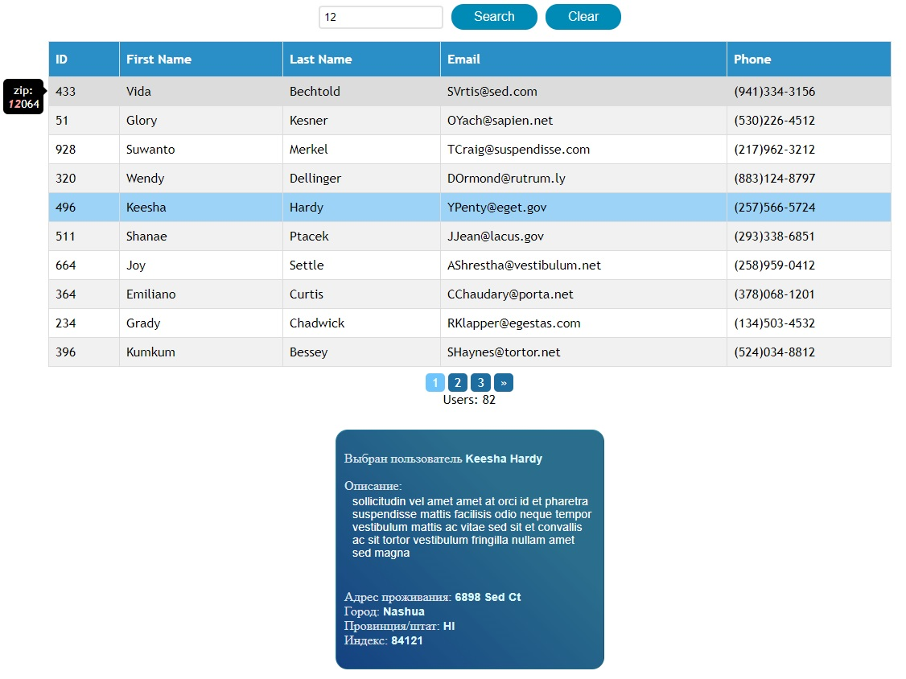

## Задание

Необходимо разработать React-приложение для отображения таблицы с данными.

__Функционал__

- Сортировка по столбцам: при нажатии на название столбца строки таблицы сортируются по возрастанию, при повторном клике &mdash; по убыванию. Графическим элементом или текстовым сообщением указывается направление сортировки.
- Клиентская пагинация: данные необходимо отображать постранично, максимум 50 элементов на страницу. Необходимо предоставить пользовательскую навигацию для перехода по страницам.
- Фильтрация: компонент предоставляет текстовое поле, в которое пользователь может ввести текст и строки таблицы, данные которых не содержат подстроку, введённую пользователем, скрываются. Перефильтрация осуществляется по нажатию на кнопку "Найти".
- По клике на строку таблицы значения полей выводятся в дополнительном блоке под таблицей.
- Данные в таблицу загружаются с сервера. Способ загрузки с сервера на ваш выбор.

Для демонстрации работы компонента необходимо сделать простую HTML страницу.
Пользователю предлагается выбрать набор данных: маленький или большой.
При выборе набора данных он загружается с сервера и по данным строится таблица.

 