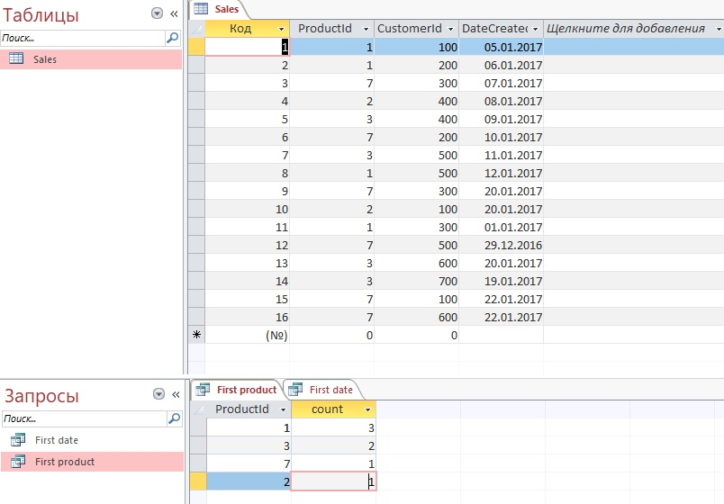

Есть таблица хранящая линии покупки: Sales: Id, ProductId, CustomerId, DateCreated

Мы хотим понять, через какие продукты клиенты «попадают» к нам в магазин.
Напишите запрос, который выводит продукт и количество случаев, когда он был первой покупкой клиента.

``` SQL
SELECT Sales.ProductId, COUNT(Sales.ProductId) as count
FROM Sales, (SELECT s2.CustomerId as Customer, Min(s2.DateCreated) AS FirstDate FROM Sales AS s2 GROUP BY s2.CustomerId)  AS fs
WHERE (((fs.FirstDate)=[Sales].[DateCreated]) AND ((fs.Customer)=[Sales].[CustomerId]))
GROUP BY Sales.ProductId
ORDER BY COUNT(Sales.ProductId) DESC;
```

 
