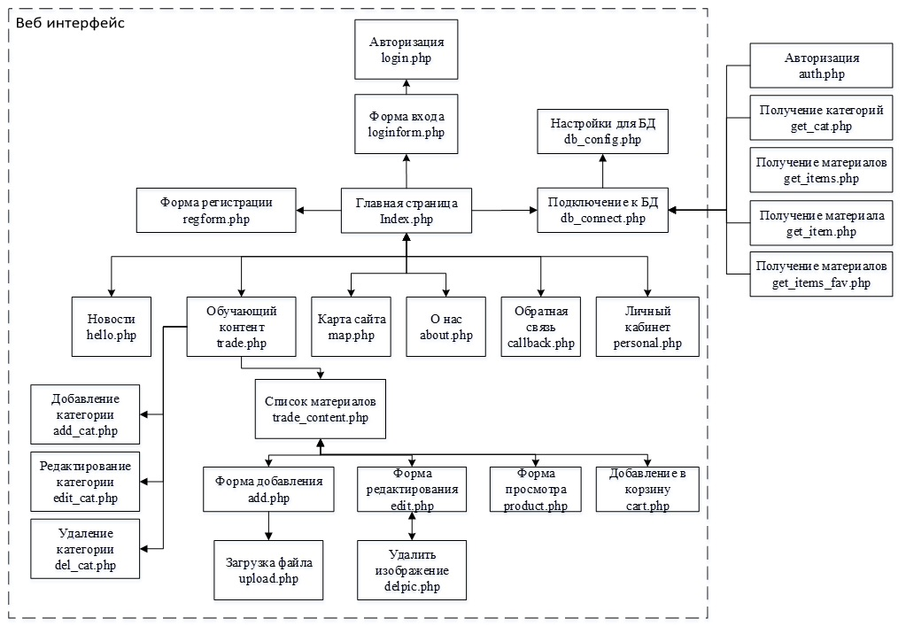
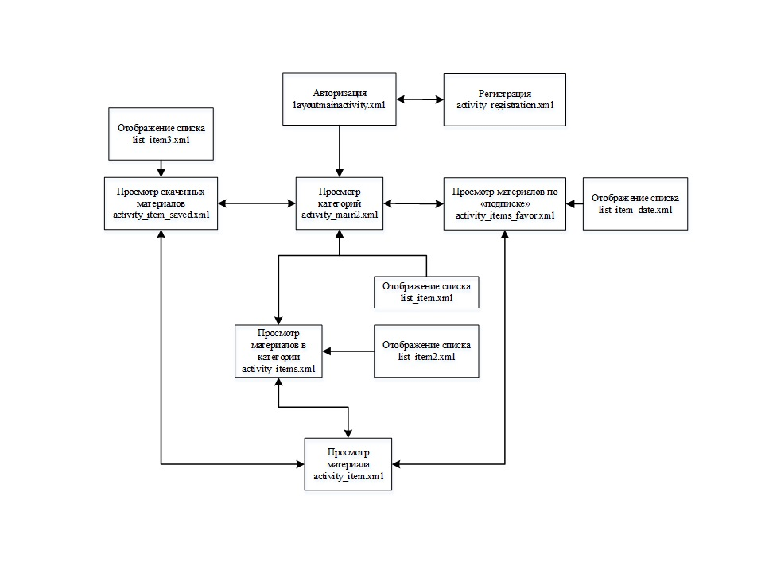
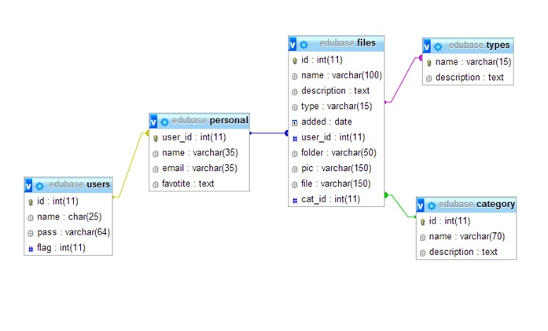
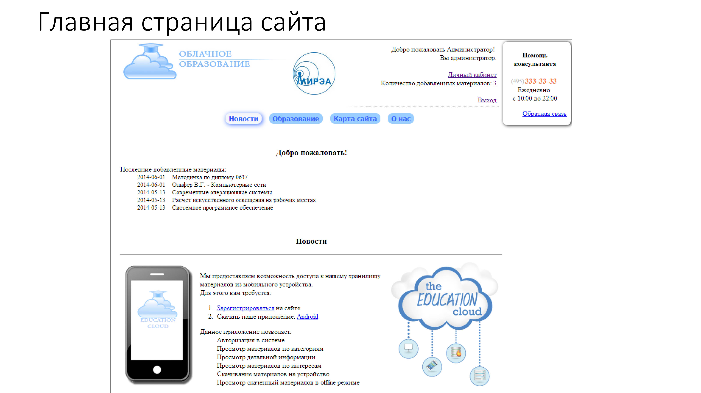
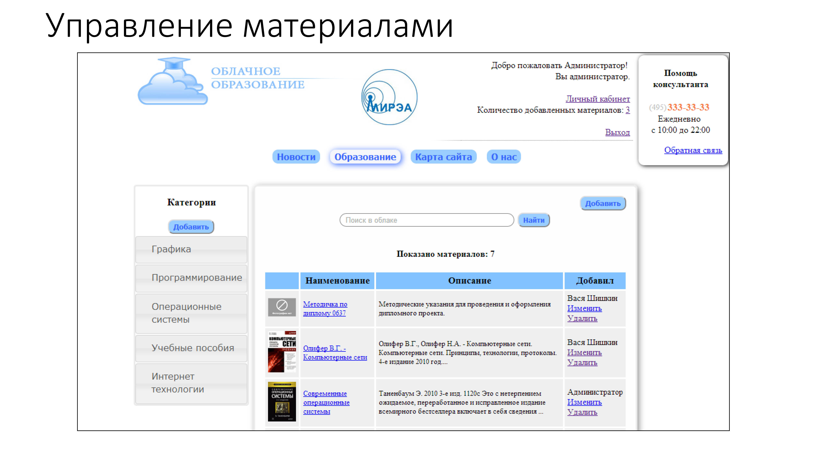
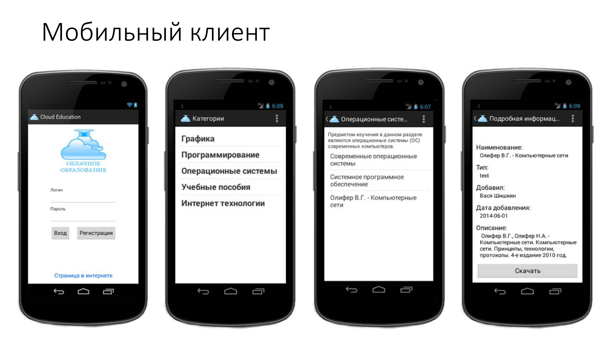

## htdocs (php / javascript, ajax)

* Регистрация
* Загрузка файлов и редактирование описания
* Личная статистика
* Администрирование разделов и всех загрузок

## Android (Java)

Работа с JSON

* Авторизация
* Просмотр избранных категорий
* Просмотр описания и скачивания файлов

## В качестве БД использован MySql

## Интерфейс

 
 
 
 

