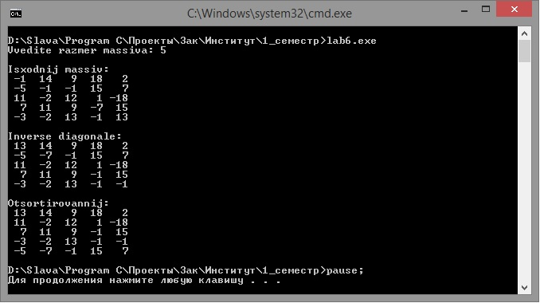
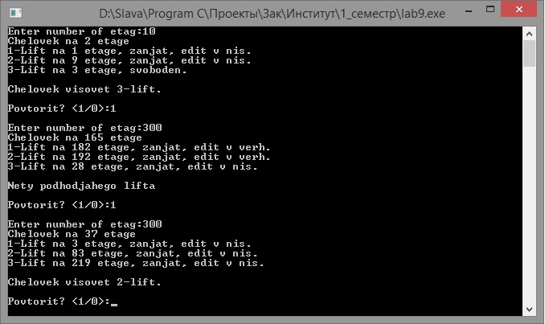

Задание_lab6
-
1)	Изменить порядок следования элементов главной диагонали квадратной матрицы на противоположный, на экран вывести исходный массив и переработанный.
2)	Переставить местами строки массива в порядке убывания первых элементов строк.

 
 

Задание_lab9
-
В доме N этажей и 3 лифта. Каждый лифт либо свободен, либо занят и направляется в какую-то сторону. Человек стоит на этаже вызовет свободный лифт, либо занятый ближайший, направляющийся к нему.
Распечатать начальную расстановку.

Передавать структуру через указатель в функцию пользователя, и там осуществлять основные вычисления.

 
 

