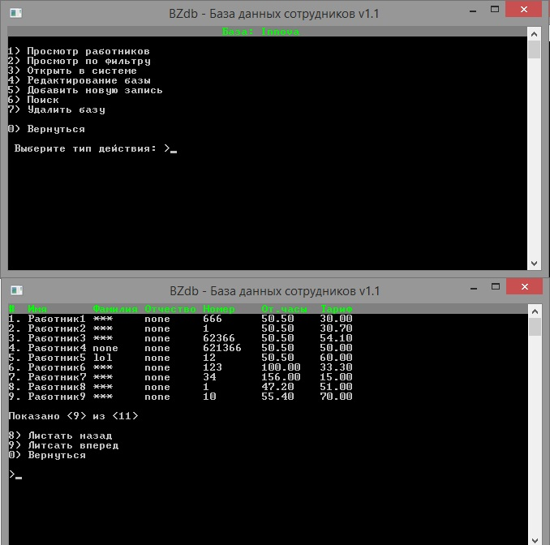

Потоки ввода/вывода

Необходимо создать программу для работы с собственной базой данных, в которой следует предусмотреть создание меню с выбором действия:

•	newFile (создать)
•	viewFile (просмотр)
•	addFile (добавление новой записи)
•	editFile (корректирование записи файла)
•	runFile (выполнение задачи)

Задание

Информация о сотрудниках фирмы содержит:
1)	Фио
2)	Табельный номер
3)	Отработанные часы
4)	Почасовой тариф

Рабочее время больше 144 часов оплачивается в два раза больше.
Вывести размер заработной платы с учетом налогов.

   
