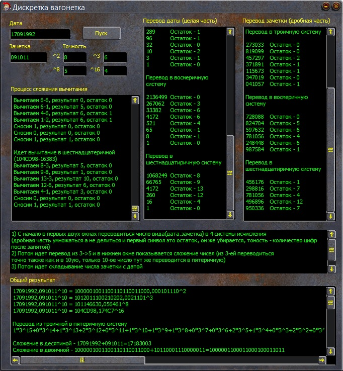

1.	Представить в виде цифрового кода в десятичной системе исчисления дату своего рождения (целая часть) и номер своей зачетной книжки (дробная часть)
2.	Перевести полученное число в двоичную, троичную, восьмеричную и шестнадцатеричную системы исчисления. 
3.	Перевести из меньшей системы исчисления в большую.
4.	Провести сложение, а потом вычитание от большего числа меньшее число, т.е. целой части полученного числа, и дробной части, представленной как целые числа в двоичной, троичной, восьмеричной и шестнадцатеричной системах исчисления.
5.	Результат перевести в десятичную систему исчисления.

 
 

