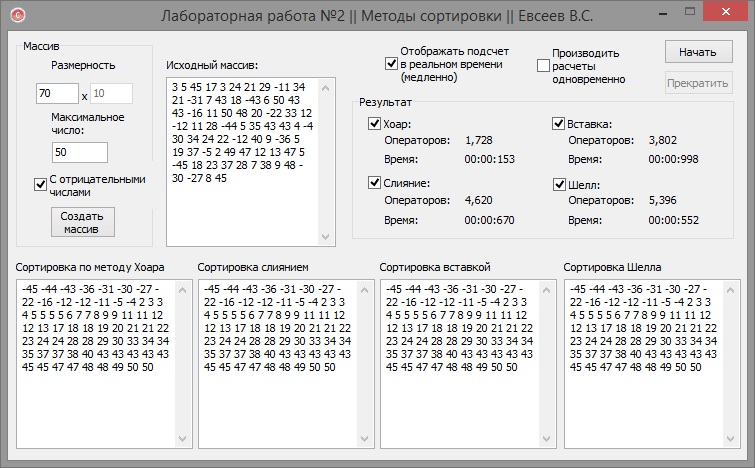

1) Разработать 3 (4) функции сортировки
2) Просчитать количество операций
3) Рассмотреть критические ситуации на входе 
4) Сравнить скорость на разных количествах элементов

Алгоритмы: слияние, метод хоара, шелла и метод вставки

 
 

