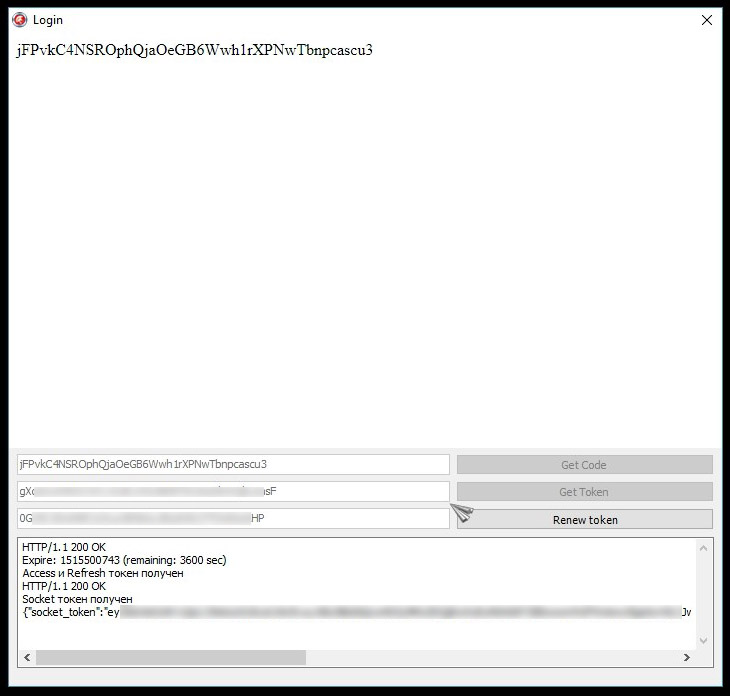
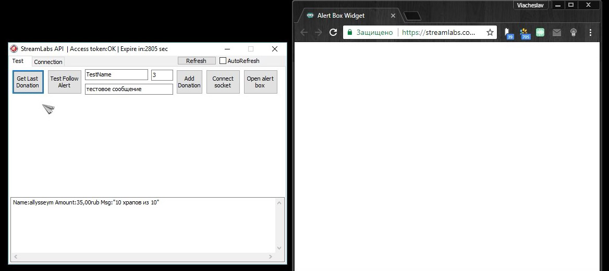
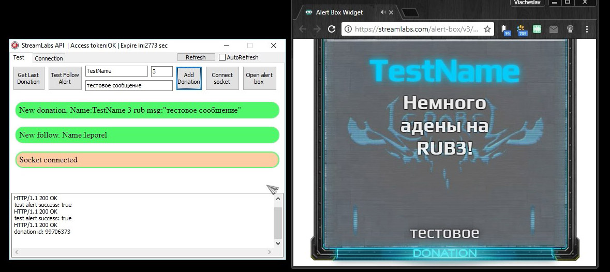

Программа для работы с API сервиса StreamLabs  
Запрос токена, обновление текена, получения информации от сервиса и добавление.

Сокет работает через JavaScript - /socket.html

Использованы сторонние компоненты:
TChromium - Chromium-based browsers https://github.com/salvadordf/CEF4Delphi

<h1>Получение токенов</h1>

<h2>Последний донат</h2>

<h2>Сокет и тестовый алерт</h2>

<h2>Сокет и добавление доната</h2>

